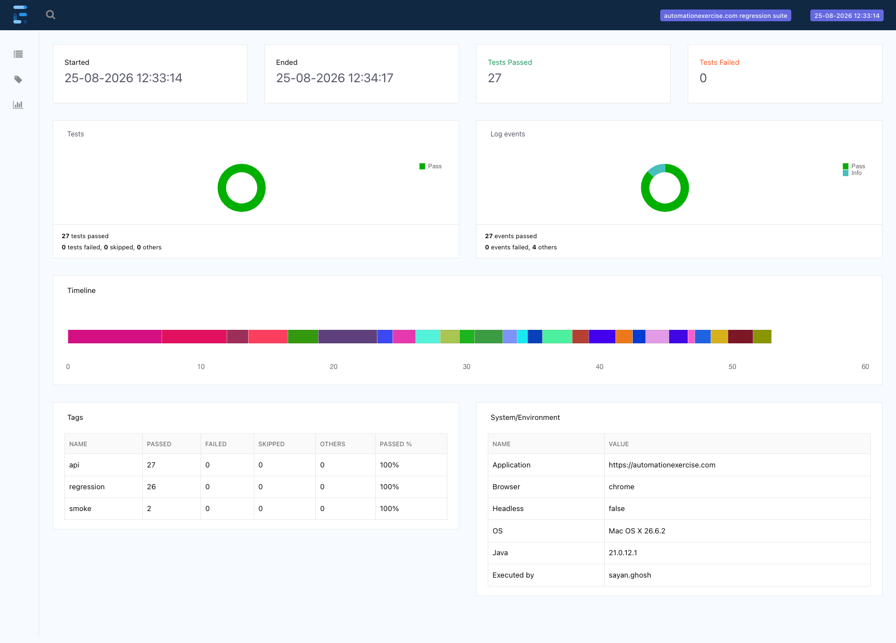
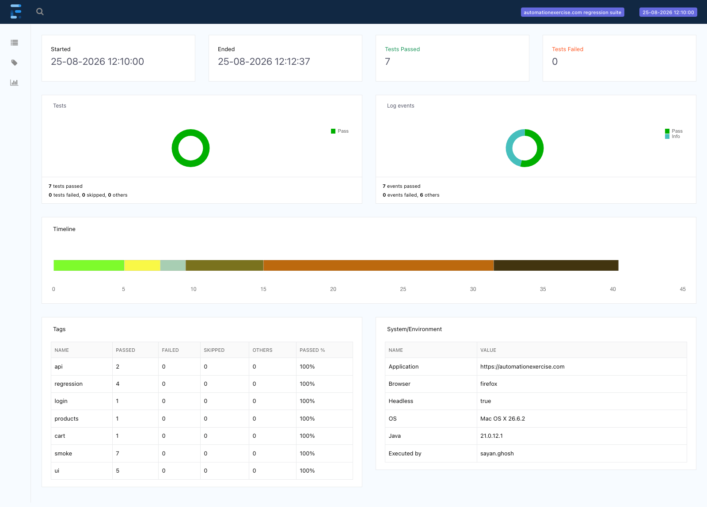

# Hybrid UI + API Test Automation Framework

Selenium WebDriver, TestNG and Rest Assured against [automationexercise.com](https://automationexercise.com) —
a Maven project built on the Page Object Model, driven by Excel data, reported through
ExtentReports and wired to GitHub Actions.

[](https://github.com/DattaOindrila/selenium-hybrid-framework/actions/workflows/regression.yml)

---

## Latest run

**120 tests, 120 passed, 0 failed, 0 skipped, 0 retries — 9 min 35 s**
Chrome 151, headless, macOS, JDK 21. Full console output: [`docs/console-output.txt`](docs/console-output.txt).

The same suite on CI: **120 passed, 0 failed — 6 min 00 s** on `ubuntu-latest`, headless
Chrome 151, Temurin JDK 21. That run needed **one retry** (see Known Limitations #8).


---

## Tech stack

| Layer | Tool | Version |
|---|---|---|
| Language | Java | 21 (source/target 17) |
| Build | Maven | 3.9.16 (wrapper included) |
| UI automation | Selenium WebDriver | 4.47.0 |
| Test runner | TestNG | 7.12.0 |
| API testing | Rest Assured | 6.0.1 |
| Schema validation | Rest Assured JSON Schema Validator | 6.0.1 |
| Test data | Apache POI | 5.5.1 |
| Data generation | Datafaker | 2.7.0 |
| Reporting | ExtentReports (Spark) | 5.1.2 |
| Logging | Log4j2 | 2.26.1 |
| CI | GitHub Actions | — |

Every version was checked against Maven Central when the project was built, not copied from a
tutorial. **There is deliberately no WebDriverManager**: Selenium Manager has been built into
Selenium since 4.6 and resolves the matching driver binary automatically.

---

## Architecture

```
selenium-hybrid-framework/
├── .github/workflows/regression.yml    push, PR and manual triggers
├── src/
│   ├── main/java/com/qa/
│   │   ├── base/          BasePage, DriverFactory
│   │   ├── pages/         one class per page
│   │   │   └── components/  HeaderComponent, FooterComponent  (shared across every page)
│   │   ├── api/
│   │   │   ├── client/    BaseApiClient, UserApiClient, ProductApiClient
│   │   │   └── model/     UserAccount, Product, Brand
│   │   ├── utils/         ConfigReader, ExcelReader, WaitUtils,
│   │   │                  ScreenshotUtils, ExtentManager, TestDataFactory
│   │   └── constants/     AppConstants
│   └── test/
│       ├── java/com/qa/
│       │   ├── base/          BaseTest (browser), BaseApiTest (no browser)
│       │   ├── helpers/       TestAccountManager
│       │   ├── tests/ui/      7 UI classes + the cross-validation class
│       │   ├── tests/api/     3 API classes
│       │   ├── dataproviders/ TestDataProviders
│       │   └── listeners/     TestListener, RetryAnalyzer, RetryListener
│       └── resources/
│           ├── config/config.properties
│           ├── testdata/testdata.xlsx      4 sheets, 21 data rows
│           ├── schemas/                    4 JSON schemas
│           ├── suites/                     regression.xml, smoke.xml, api.xml
│           └── log4j2.xml
├── docs/screenshots/     proof captured from real runs
└── reports/              generated output (gitignored)
```

### Why the Page Object Model

Locators change far more often than test intent does. When the site renames a button, the Page
Object Model means exactly one file changes and every test that uses that button keeps working.
The alternative — locators inline in tests — turns one markup change into a day of edits.

The header and the newsletter footer appear on every page, so they are modelled as **components**
rather than repeated in ten page classes. `BasePage` exposes them as `header()` and `footer()`, so
any page can do `checkoutPage.header().clickLogout()`.

Page objects hold locators and business methods only. Every `click`, `type` and `getText` lives in
`BasePage`, which is also where the waiting happens.

### Why ThreadLocal in DriverFactory

TestNG can run test methods in parallel threads. A single static `WebDriver` field would be shared
by all of them, so one thread would navigate the browser another thread was asserting against.
`ThreadLocal<WebDriver>` gives each thread its own driver, so the same page-object code is correct
whether the suite runs single-threaded or with `thread-count=3`.

`quitDriver()` calls `remove()` as well as `quit()`. TestNG returns threads to a pool and reuses
them, so an entry left behind would be picked up by a later test and used after the browser had
already closed.

`ExtentManager` holds its `ExtentTest` in a `ThreadLocal` for exactly the same reason.

### Explicit waits only

There is **no `Thread.sleep()` anywhere in this repository**, and no implicit wait is ever set.
Mixing implicit and explicit waits makes timeouts unpredictable, because the implicit wait keeps
polling inside the explicit wait's own polling loop. All waiting goes through `WaitUtils`.

---

## Features

- Page Object Model with reusable header/footer components
- Thread-safe `ThreadLocal` driver — parallel execution is safe
- Cross-browser: Chrome, Firefox and Edge selectable by config or `-Dbrowser`
- Headless toggle for CI
- Data-driven testing from Excel via Apache POI and TestNG `@DataProvider`
- Rest Assured API layer with JSON schema validation
- **API↔UI cross-validation** — write through one layer, read through the other
- Automatic screenshot on every failure, embedded in the HTML report as Base64
- ExtentReports with per-tag breakdown and the real environment of the run
- Log4j2 to console and rolling file
- `RetryAnalyzer` for genuine network flakiness, capped at one retry
- Third-party ad hosts blocked at the browser level for deterministic runs
- GitHub Actions on push, PR and manual dispatch, with the report as a build artefact

---

## Setup and running

### Prerequisites

- **JDK 17 or newer** (built and verified on JDK 21)
- **Chrome and/or Firefox** installed
- Maven is *not* required — the repository ships a wrapper

No driver binaries to download and no `PATH` entries to set: Selenium Manager resolves the driver
that matches your installed browser at runtime.

### Clone and run

```bash
git clone https://github.com/DattaOindrila/selenium-hybrid-framework.git
cd selenium-hybrid-framework
./mvnw clean test
```

That runs the full regression suite in a visible Chrome window. It takes roughly ten minutes
because it drives a real browser against a real website over the internet.

### Start with the smoke suite

```bash
./mvnw clean test -Dsuite=smoke.xml -Dheadless=true
```

Seven tests, well under two minutes. Run this first after cloning — it proves the toolchain, the
browser and the target site are all working before you invest ten minutes in the full suite.

### Command-line options

| Flag | Values | Default |
|---|---|---|
| `-Dsuite` | `regression.xml`, `smoke.xml`, `api.xml` | `regression.xml` |
| `-Dbrowser` | `chrome`, `firefox`, `edge` | `chrome` |
| `-Dheadless` | `true`, `false` | `false` |

```bash
# The API suite only - no browser, about a minute
./mvnw clean test -Dsuite=api.xml

# Firefox, headless
./mvnw clean test -Dbrowser=firefox -Dheadless=true

# Exactly how CI runs it
./mvnw clean test -Dsuite=regression.xml -Dbrowser=chrome -Dheadless=true
```

Precedence is `-D` system property → environment variable → `config.properties`, so nothing has to
be edited to run the suite differently.

### Where the output goes

- `reports/ExtentReport_<timestamp>.html` — open this in a browser
- `reports/screenshots/` — failure screenshots as PNG files
- `reports/logs/automation.log` — Log4j2 output
- `target/surefire-reports/` — raw TestNG XML

---

## Test coverage

**99 test methods → 120 executions** (data-driven methods run once per spreadsheet row).

| Class | Methods | Executions | Covers |
|---|---:|---:|---|
| `RegistrationTest` | 8 | 11 | Full 18-field registration, duplicate e-mail, pre-filled fields, country list, delete account, deleted account cannot log in |
| `LoginLogoutTest` | 10 | 15 | Valid login, six invalid combinations from Excel, empty and malformed e-mail, logout, session clearing, password case and whitespace sensitivity |
| `ProductSearchTest` | 12 | 18 | All-products listing, positive and negative searches from Excel, case-insensitivity, category and brand navigation, price format |
| `ProductDetailsTest` | 9 | 9 | All published attributes, listing↔detail consistency, quantity, review submission, empty review, non-existent product |
| `CartTest` | 12 | 12 | Add, multiple items, line totals, quantity, remove, empty cart, persistence, modal behaviour, anonymous checkout block |
| `CheckoutOrderTest` | 9 | 9 | Delivery and billing addresses, address matches registration, totals, end-to-end order, invoice amount, order comment, cart emptied |
| `ContactSubscriptionTest` | 9 | 11 | Contact form from Excel, confirm dialog accept and dismiss, file upload, subscription from two pages |
| `SmokeTest` | 2 | 2 | Home page loads, anonymous header |
| **UI subtotal** | **71** | **87** | |
| `ProductApiTest` | 10 | 15 | APIs 1–6: products, brands, search, unsupported methods, schema validation |
| `UserApiTest` | 11 | 11 | APIs 7–14: create, verify, read, update, delete, and the negative paths |
| `ApiSmokeTest` | 1 | 1 | Catalogue endpoint reachable |
| **API subtotal** | **22** | **27** | |
| `ApiUiCrossValidationTest` | 6 | 6 | Both layers — see below |
| **Total** | **99** | **120** | |

### Data-driven coverage

`src/test/resources/testdata/testdata.xlsx` — four sheets, 21 rows, read by `ExcelReader` and fed
through `TestDataProviders`:

| Sheet | Rows | Feeds |
|---|---:|---|
| `Login` | 6 | Six invalid credential combinations, each with its expected error |
| `Registration` | 4 | Four complete account profiles across three countries |
| `Search` | 8 | Six terms expected to match, two expected to return nothing |
| `ContactUs` | 3 | Three enquiry shapes including minimum-length values |

Each row arrives as a `Map<String, String>` keyed by column name, so a test reads
`row.get("password")` rather than `row[2]`. Inserting a column into the spreadsheet cannot silently
break an unrelated test.

The registration e-mail address is the one value **not** taken from the spreadsheet: the site
rejects an address that already exists, so a fixed address would pass on the first run and fail
forever afterwards. It is generated uniquely per run, and every account the suite creates is
deleted again before the class finishes.

### API↔UI cross-validation

This is the part of the repository worth reading first. Every other class tests one layer in
isolation: a UI test can only prove the browser showed something plausible, an API test can only
prove an endpoint answered correctly. Neither can prove the two agree.

`ApiUiCrossValidationTest` writes through one layer and reads through the other:

| Test | Direction | What it proves |
|---|---|---|
| `accountCreatedViaApiCanLogInThroughTheUi` | API writes → UI reads | An account created over HTTP is genuinely usable in the shop. `responseCode 201` alone says nothing about whether a human could ever log in. |
| `accountRegisteredThroughTheUiIsVisibleToTheApi` | UI writes → API reads | The registration form persisted what was typed — verified through a different channel, not by the site agreeing with its own confirmation page. |
| `uiCatalogueMatchesTheApiCatalogue` | Both read | The shop renders exactly the catalogue the API publishes; a product live in the database but missing from the listing would be invisible to either layer alone. |
| `productPriceMatchesBetweenUiAndApi` | Both read | The price a shopper sees is the price the API reports. |
| `searchResultsMatchBetweenUiAndApi` | Both read | Search is one feature behind two front doors; the failure message names exactly which products differ. |
| `accountDeletedViaApiCannotLogInThroughTheUi` | API deletes → UI must agree | "Account deleted!" is worth nothing if the browser can still sign in. |

### A note on this API's status codes

`automationexercise.com` returns **HTTP 200 for every request, including errors**. The real status
is a `responseCode` field inside the JSON body:

```
POST /api/verifyLogin   with bad credentials
  ->  HTTP 200   {"responseCode": 404, "message": "User not found!"}
```

Every API test therefore asserts twice: on the transport status (always 200, proving the endpoint
was reached) and on the body-level `responseCode` (the actual outcome). A test that only checked
the HTTP status here could never fail.

---

## Reporting and screenshots

`TestListener` implements `ITestListener`, so screenshot capture is automatic and complete. There
is no screenshot code in any test — a `catch` block in each test is exactly what gets forgotten,
and a passing test has no `catch` block to put it in.

On failure the listener writes a PNG to `reports/screenshots/` **and** embeds the same image as
Base64 in the HTML report, so the report still shows its images after being downloaded from a CI
build artefact.


The embedded screenshot, expanded:


The API suite, which starts no browser and finishes in about a minute:



The same framework driven by Firefox — note `Browser: firefox` in the environment table:



Console output from the full regression run:


> The console image is a rendering of the real captured output, not a photograph of a terminal.
> The verbatim log is committed at [`docs/console-output.txt`](docs/console-output.txt) so the two
> can be checked against each other.

---

## CI/CD

[`.github/workflows/regression.yml`](.github/workflows/regression.yml) runs on **push to main**,
**pull request** and **manual dispatch** (with a dropdown to pick the suite).

The job checks out the repository, sets up Temurin JDK 21 with `~/.m2` cached against `pom.xml`,
pins Chrome to stable, prints the toolchain it actually used, and runs:

```bash
mvn -B clean test -Dsuite=regression.xml -Dbrowser=chrome -Dheadless=true
```

The ExtentReport, the failure screenshots and the Surefire results are uploaded as artefacts with
`if: always()` — the report matters most when the suite has failed. A step summary reads the counts
straight out of TestNG's own results file, so it cannot disagree with what ran.

Verified: the first push produced a green run in 6m00s with 120/120 passing and both artefacts
uploaded.


---

## Known limitations

Written plainly, because a portfolio that claims everything worked perfectly is not believable.

1. **Edge is implemented but unverified on the build machine.** `DriverFactory` has full Edge
   support and it is one `-Dbrowser=edge` away. On the machine this project was built on, the Edge
   process is killed immediately on launch (`SIGKILL`) — including outside Selenium entirely, so it
   is an environment restriction rather than a framework problem. **Chrome and Firefox have both
   been run and are the only browsers claimed here.** To verify Edge yourself:
   `./mvnw clean test -Dsuite=smoke.xml -Dbrowser=edge -Dheadless=true`

2. **The GitHub Actions badge has not yet gone green**, because the repository has not been pushed
   at the time of writing. The workflow YAML is validated and complete; the badge URL needs the
   real `DattaOindrila/selenium-hybrid-framework` substituted.

3. **Third-party advertisements had to be blocked to get deterministic runs.** The site serves
   Google auto-ads, which did two things to the product grid: appended advert text inside a
   product's name element, and wrapped other names in `<a class="google-anno">` so the text moved
   into a child node. Product names read back as `"Sleeves Printed Top - WhiteProduct Photography
   Service"` or as empty. Both were found by failing tests, not predicted. `DriverFactory` now
   resolves the ad hosts to `127.0.0.1`, and the name extraction defends against both shapes anyway.

4. **The cart has no quantity editor.** The site renders cart quantity as a disabled button, so
   "update the quantity" always means setting it on the product detail page before adding. The cart
   tests do exactly that and say so in a comment.

5. **`/checkout` is not protected.** An anonymous visitor is not redirected away; the page renders
   with an empty address block. No customer data leaks, so `anonymousVisitorSeesNoCustomerDetailsAtCheckout`
   asserts that — but the URL arguably should not be reachable at all. This is a finding about the
   application, not about the framework.

6. **Search matches category as well as name.** Searching `top` legitimately returns
   "Little Girls Mr. Panda Shirt", whose category is "Tops & Shirts". An assertion that every
   result name contains the term would fail against correct behaviour, so the strict per-result
   check lives in the API tests, which can see the category. The UI listing never renders it.

7. **There is no order-history feature on this site**, so there are no order-history tests. Orders
   are covered end to end through checkout, payment and the confirmation page, including reading
   the order total back off the invoice link.

8. **`RetryAnalyzer` exists and retries a failed test once.** The application under test is a
   shared public site reached over the open internet, and a small number of failures are genuinely
   environmental. Every retry is logged. The limit is one and is not raised, because retries hide
   real bugs — a test that only passes on the second attempt is telling you something.
   **The local 120/120 run needed zero retries. The first CI run needed exactly one**:
   `CheckoutOrderTest.checkoutTotalMatchesTheCartTotal` timed out waiting for the product detail
   page to load on the runner, and passed on the second attempt. That is precisely the case this
   mechanism is for — a slow response from a shared public site, not a defect — and it is reported
   here rather than buried, because a pass rate quoted without mentioning retries is misleading.
   Set `retry.count=0` in `config.properties` to disable the mechanism entirely.

9. **Parallelism is deliberately low** (`thread-count=2`). The framework is thread-safe and this
   number could go higher, but the target is a shared practice site and hammering it would be both
   rude and a good way to manufacture flakiness that looks like a product defect.

10. **The suite creates and deletes real accounts** on the practice site. Every account is removed
    in teardown. Card details in `config.properties` are the publicly documented Visa test number;
    the site has no payment gateway behind it and nothing is ever charged.

---

## Running order and conventions

- Every UI test gets a **fresh browser**. That is slower than sharing a session and it is the right
  trade: a test that inherits cookies or a half-filled cart from whatever ran before it is not an
  independent test, and the failure it eventually produces is unreproducible in isolation.
- Tests that need a logged-in user create the account through the **API**, not through the
  registration form. A cart test is about the cart; driving eighteen form fields first makes it
  slower and makes it fail for reasons that belong to the registration test.
- No credentials, URLs or test data are hardcoded in any test class.
